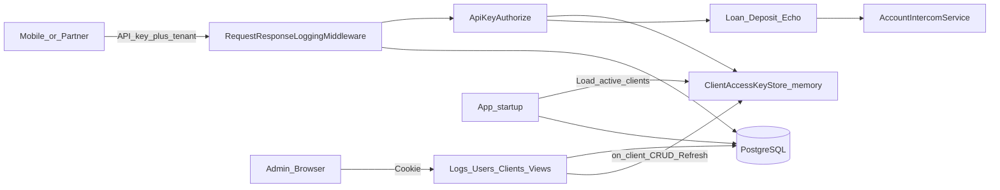

# Postgres request logging, auth, and admin dashboard

## Current state

- ASP.NET Core **net10.0** API-only middleware proxying to CBS account services via [`AccountIntercomService`](ISmartConnect.Module/Intercom/AccountIntercomService.cs).
- Controllers (`Deposit`, `Loan`, `Echo`) use [`ApiKeyAuthorizeAttribute`](ISmartConnect/ApiKeyAuthorizeAttribute.cs): `Authorization` header key → `AccessKeys` in config → tenant/`ClientCode` via [`UserMeta`](ISmartConnect/UserMeta.cs).
- [`Program.cs`](ISmartConnect/Program.cs) already calls `AddControllersWithViews()` but has **no Views**, no DB, and exception logging is commented out.
- No existing UI or user store.

## Decisions (locked in)

| Concern | Choice |
|--------|--------|
| UI | **Razor MVC** in the same web app (matches existing `AddControllersWithViews`) |
| Users | Admin accounts for dashboard login (cookie auth) |
| Clients | API consumers replacing `AccessKeys` (code, name, api_key, active flag) |
| Naming | **DB** tables/columns/indexes/constraints = `snake_case`; **C#** stays PascalCase mapped via EF naming conventions |
| Auth for API | Keep header-based API key flow; **authorize from in-memory cache only** (never hit DB per request) |
| AccessKeys config | Seed into `clients` once; then drop per-request use of `AccessKeys`. Do **not** rewrite `appsettings` or restart the app when adding clients |

## Why not write appsettings + reload

Writing `AccessKeys` back to `appsettings.json` and restarting (or even hot-reloading config) is fragile: file permissions in containers, multi-instance deployments get out of sync, secrets end up in deployable files, and restarts drop in-flight requests. Same goal (fast authorize, no DB per call) is met with an **in-memory dictionary** backed by Postgres as the source of truth.

## Architecture

## 1. EF Core + PostgreSQL

**Packages** (in [`ISmartConnect.csproj`](ISmartConnect/ISmartConnect.csproj)):

- `Npgsql.EntityFrameworkCore.PostgreSQL`
- `Microsoft.EntityFrameworkCore.Design`
- `EFCore.NamingConventions`

**Config**: add `ConnectionStrings:DefaultConnection` to [`appsettings.json`](ISmartConnect/appsettings.json) / Development.

**DbContext** (`ISmartConnect/Data/AppDbContext.cs`): `UseNpgsql` + `UseSnakeCaseNamingConvention()`.

### Tables

**`users`** — dashboard admins

- `id` (uuid, PK)
- `username` (unique)
- `password_hash`
- `display_name`
- `is_active`
- `created_at`, `updated_at`

**`clients`** — API consumers (replaces `AccessKeys`)

- `id` (uuid, PK)
- `code` (unique; current tenant value e.g. `dev`)
- `name`
- `api_key` (unique)
- `is_active`
- `created_at`, `updated_at`

**`request_logs`** — every API request/response (+ errors)

- `id` (uuid, PK)
- `requested_at` (timestamptz)
- `duration_ms` (int)
- `http_method`, `path`, `query_string`
- `client_id` (nullable FK → `clients`)
- `client_code` (denormalized text for filter/display)
- `ip_address`
- `request_headers` (text, redacted Authorization)
- `request_body` (text, size-capped)
- `status_code` (int)
- `response_body` (text, size-capped)
- `is_error` (bool)
- `error_message`, `exception_details` (text, nullable)

### Indexes

- `users_username_uidx` on `users(username)`
- `clients_code_uidx` on `clients(code)`
- `clients_api_key_uidx` on `clients(api_key)`
- `request_logs_requested_at_idx` on `request_logs(requested_at DESC)`
- `request_logs_path_idx` on `request_logs(path)`
- `request_logs_client_code_idx` on `request_logs(client_code)`
- `request_logs_status_code_idx` on `request_logs(status_code)`
- `request_logs_is_error_idx` on `request_logs(is_error)` where useful for error-only filters

Initial EF migration under `ISmartConnect/Data/Migrations/`. Seed one admin user (password hashed) and migrate existing `AccessKeys` entry (`p9Et1Q7gLlQkvBL5RZxgohnr` → `dev`) into `clients` via migration/data seed so the API keeps working.

## 2. Request/response logging middleware

Add [`RequestResponseLoggingMiddleware`](ISmartConnect/Middleware/RequestResponseLoggingMiddleware.cs):

- Enable request body buffering; tee response body to a memory stream.
- Record start time; after `next()`, compute `duration_ms`.
- Persist one `request_logs` row (fire-and-forget scoped DbContext via `IServiceScopeFactory` so logging never breaks the API).
- Cap body length (e.g. 64KB) and **redact** `Authorization` / api keys in stored headers.
- Skip non-API noise: `/swagger`, `/openapi`, static files, and dashboard routes (`/Account`, `/Logs`, `/Users`, `/Clients`, `/`).
- On unhandled exceptions: set `is_error`, `error_message`, `exception_details`, and still write the log; wire this into the existing [`UseExceptionHandler`](ISmartConnect/Program.cs) path so ISO error responses remain unchanged while errors are persisted.

## 3. API authorize via in-memory cache (no DB per request)

Add singleton `IClientAccessKeyStore` / `ClientAccessKeyStore`:

- Holds `ConcurrentDictionary<string, string>` mapping `api_key` → `client_code` (active clients only).
- **Warm at startup**: after migrate/seed, load all `clients` where `is_active` into the dictionary.
- **Refresh on change**: Clients setup CRUD (create / edit / deactivate / rotate key) saves to Postgres, then calls `RefreshAsync()` (or incremental Add/Update/Remove) so new keys work immediately **without** rewriting `appsettings` or restarting.
- Thread-safe swap/replace of the map so authorize stays lock-light.

Update [`ApiKeyAuthorizeAttribute`](ISmartConnect/ApiKeyAuthorizeAttribute.cs) + [`UserMeta`](ISmartConnect/UserMeta.cs):

- Resolve `Authorization` header via `IClientAccessKeyStore.TryGetClientCode(apiKey)` only — same behavior as today’s `configuration[$"AccessKeys:{requestKey}"]`, but from memory.
- Tenant header must still match client code; inactive/missing key → 401/400 as today.

`AccessKeys` in appsettings: used only for **initial seed** into `clients` (or remove after first deploy). Runtime authorize does not read config. Keep `MicroService` section unchanged.

## 4. Admin login (users)

- Cookie authentication (`AddAuthentication().AddCookie`) for MVC only; API controllers stay on `[ApiKeyAuthorize]`.
- `AccountController`: Login (GET/POST), Logout.
- Password hashing with `PasswordHasher<User>` (ASP.NET Core crypto, no full Identity stack).
- `[Authorize]` on dashboard controllers; unauthenticated → `/Account/Login`.
- Layout with nav: Logs | Clients | Users | Logout.

## 5. Log dashboard with filters

`LogsController` + Razor views:

- Paginated table of `request_logs`.
- Filters: date range, path, client, status code, `is_error`, free-text search on body/error.
- Detail view for a single log (full request/response/exception).

## 6. Setup pages — users & clients

**Users** (`UsersController`): list / create / edit / deactivate; set/reset password.

**Clients** (`ClientsController`): list / create / edit / activate-deactivate; generate or set `api_key`; show `code` used as `tenant` header. After every successful client mutation, **refresh `ClientAccessKeyStore`** so authorize picks up changes immediately (no app reload).

## 7. Program.cs wiring

Order of note:

1. Exception handler (unchanged ISO JSON contract; also attach error log fields)
2. Swagger
3. Routing / CORS / Authentication / Authorization
4. Request-response logging middleware (around controllers; after auth so client is available when known)
5. `MapControllers` + default MVC route for dashboard

Register `AppDbContext`, singleton `IClientAccessKeyStore`, cookie auth; on startup `Migrate()` + seed + **warm access-key cache**.

## Out of scope

- Changing mobile banking request/response contracts or intercom URLs
- Separate SPA frontend
- Full ASP.NET Identity roles/claims beyond simple admin users
- Writing client keys back into `appsettings.json` or recycling the process to pick up new keys
- Multi-node cache sync (single-instance in-memory is enough; if later scaled out, add a shared cache or pub/sub refresh)
